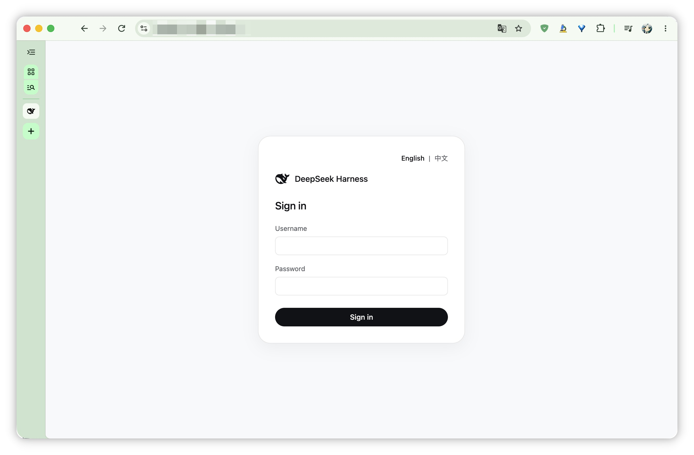
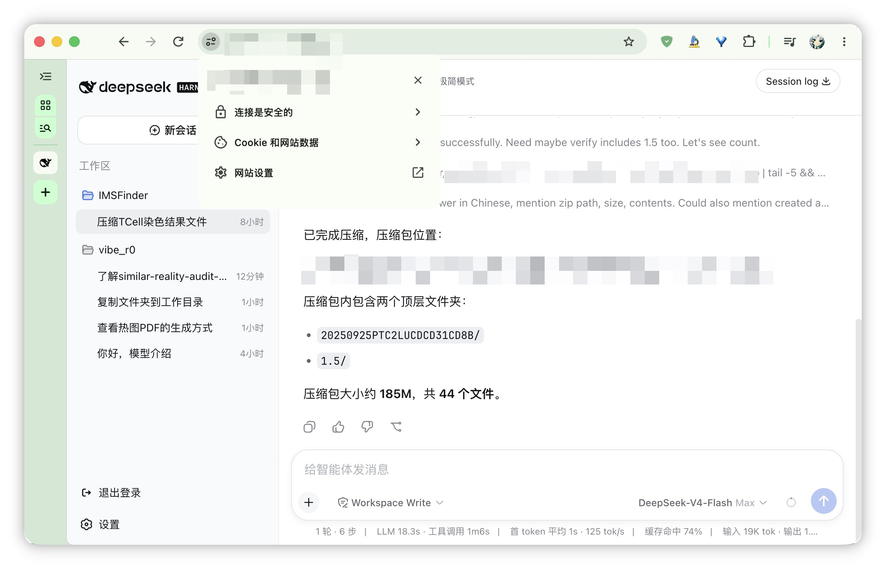

# DSH Hub

[English](README.md) | 中文

在浏览器里使用类 Unix 机器（Linux 或 macOS）上的 DeepSeek Harness。公网机器跑 Hub；类 Unix 机器只出站连接，不开放入站端口。

```text
browser  ──HTTPS──▶  Hub (public, TLS reverse proxy)  ◀──WSS (outbound)──  Agent + dsh (Unix-like)
```





两台机器都需要 Node.js >= 22.19，以及本仓库。类 Unix 机器上还要能运行 `dsh`。

```sh
node -v
```

安装完成后，命令是 `dsh-hub`，不需要 `npx`。

## 1. 安装

两台机器都执行：

```sh
git clone git@github.com:ZhimingYe/dsh-hub.git
cd dsh-hub
npm install
npm install -g .
```

确认命令已在 `PATH` 中：

```sh
dsh-hub --help
```

以后升级代码再执行一次 `npm install -g .`。
不装到系统时，在仓库根目录用 `npx dsh-hub`。

在类 Unix 机器上确认 `dsh` 可用：

```sh
dsh --help
```

若没有全局 `dsh`，另装 [DeepSeek Harness](https://github.com/deepseek-ai/deepseek-harness)，在其仓库根目录执行 `pnpm install && pnpm run build`，再保证 `dsh` 在 `PATH` 中。

## 2. 启动 Hub

在公网机器上：

```sh
dsh-hub serve --user alice
```

按提示输入密码（不回显）。首次运行会在当前目录写入 `hub.yaml`（权限 `0600`，里面是 bcrypt 哈希，不是明文）。同一时刻终端打印一次：

```text
wrote /home/you/dsh-hub/hub.yaml
DSH_HUB_AGENT_SECRET=<random>
config: /home/you/dsh-hub/hub.yaml
listen: http://127.0.0.1:8787
connect: dsh-hub connect http://<host>:8787 --user alice
```

立刻把 `DSH_HUB_AGENT_SECRET=` 这一行抄到类 Unix 机器（环境变量、`--agent-secret-file`，或之后在提示符输入）。以后再执行 `serve` 不会再打印明文。yaml 里还原不出这个值。

放行反代的 443。浏览器打开 `https://<hub-host>`，应看到登录页（默认英文，可用 English | 中文 切换）。

非回环地址上的明文 HTTP 默认拒绝。实验室短时试用才设置 `allowPlainHttp: true` 并 `host: 0.0.0.0`。

`hub.yaml` 只给 Hub 用。类 Unix 机器上的 `connect` 不读它。默认路径是 `$PWD/hub.yaml`；`serve` 每次都会打印 `config:` 绝对路径。指定文件：

```sh
dsh-hub serve --config /etc/dsh-hub/hub.yaml
dsh-hub serve --port 8788
```

```yaml
host: 127.0.0.1
port: 8787
agentSecret: "$2a$12$...."
users:
  alice: "$2a$12$...."
  bob: "$2a$12$...."
```

| 字段 | 默认 | 说明 |
|---|---|---|
| `port` | `8787` | 监听端口 |
| `host` | `127.0.0.1` | 监听地址；公网用反代，不要把 Hub 直接绑到 `0.0.0.0` |
| `agentSecret` | 必填 | `/agent` Bearer 密钥的 bcrypt 哈希；类 Unix 机器上的 `connect` 出示对应明文 |
| `allowPlainHttp` | `false` | 为 `true` 时才允许非回环明文 HTTP |
| `trustedProxies` | `[]` | 允许提供 `X-Forwarded-For` / `X-Forwarded-Proto` 的反代 IP；空列表表示忽略这些头。每项必须是 IPv4 或 IPv6 地址。Caddy 后面要写 `127.0.0.1`，登录审计才会记下浏览器 IP |
| `sessionTtlSeconds` | `604800` | 浏览器会话寿命（60–2592000）。同一用户超过 32 个未过期会话时，新登录会挤掉最旧的一个 |
| `auditLog` | `hub.yaml` 同目录的 `hub.audit.log` | 登录审计 JSONL（`login.ok` / `login.fail`）。不存在时按权限 `0600` 创建；已存在的目标必须是普通文件（不能是符号链接）。相对路径相对配置文件目录解析 |
| `users` | 必填 | 登录用户名（`[A-Za-z0-9._-]{1,64}`）到 bcrypt 哈希 |

改完配置后重新执行 `serve`。明文口令和密钥不能写进 yaml；不是 bcrypt 哈希会在加载时失败。加用户：

```sh
dsh-hub hash
dsh-hub hash --password-file ~/.dsh-hub-password
```

把打印的哈希贴进 `users:`。轮换 Agent 密钥同样 `hash` 后改 `agentSecret`，并更新类 Unix 机器上的明文。`hash` 只从提示符或 `--password-file` 读明文，不读 `DSH_HUB_PASSWORD`。

## 3. 从类 Unix 机器连接

在跑 dsh 的那台机器、同一个 uid 下：

```sh
dsh-hub connect https://hub.example.com --user alice
```

密码和 Agent 密钥都在提示符输入。密钥是首次 `serve` 打印的 `DSH_HUB_AGENT_SECRET`，不是 `hub.yaml` 里的哈希。进程保持运行。终端出现 `connecting` 后，回到浏览器用同一账号登录，应进入工作站。

dsh 的 HTTP 走 Unix 套接字：`$XDG_RUNTIME_DIR/dsh-hub-<uid>/workstation.sock`；未设置 `XDG_RUNTIME_DIR` 时为 `/tmp/dsh-hub-<uid>/workstation.sock`。该目录必须属于当前 uid 且权限 `0700`（不能是符号链接、不能被他人占用），否则 `connect` 拒绝启动。共享登录节点应设置 `XDG_RUNTIME_DIR`。

断线后自动重连。

非交互（文件权限必须是 `0600`）：

```sh
printf '%s' 'your-password' > ~/.dsh-hub-password
printf '%s' 'DSH_HUB_AGENT_SECRET-from-first-serve' > ~/.dsh-hub-agent-secret
chmod 600 ~/.dsh-hub-password ~/.dsh-hub-agent-secret
dsh-hub connect https://hub.example.com --user alice --password-file ~/.dsh-hub-password --agent-secret-file ~/.dsh-hub-agent-secret
```

或：

```sh
export DSH_HUB_PASSWORD
export DSH_HUB_AGENT_SECRET
dsh-hub connect https://hub.example.com --user alice
```

命令行不接受 `--password` 或 `--agent-secret`。

类 Unix 机器需要走 HTTP 代理才能访问 Hub 时：

```sh
export HTTPS_PROXY=http://proxy:port
export HTTP_PROXY=http://proxy:port
dsh-hub connect https://hub.example.com --user alice
```

`connect` 会启动 dsh，默认等价于：

```text
dsh --profile workstation --patch <dsh-hub-install>/workstation.cordis.yml
```

其余参数原样转给 dsh：

```sh
dsh-hub connect https://hub.example.com --user alice --patch extra.yml
dsh-hub connect https://hub.example.com --user alice --profile myweb
dsh-hub connect https://hub.example.com --user alice -- --trusted-host lab.example.com
dsh-hub connect https://hub.example.com --user alice --dump-config
```

`--` 之后的参数全部交给 dsh。不要禁用或替换 overlay 里的 `webserver-unix`、`hub-logout`、`hub-preview`，否则隧道或预览会断。指定 `--profile myweb` 时仍会打上 Hub overlay；若该 profile 不是 Web 工作站，浏览器会一直离线。

### workstation 在哪

`workstation` 是 **这台机器、当前用户** 的一份 dsh profile，不在 dsh-hub 仓库里。目录：

```text
$DSH_HOME/profiles/workstation/
```

未设置 `DSH_HOME` 时为 `~/.dsh/profiles/workstation/`。同一台机器上每个用户各有一份。第一次 `connect` 会创建：

```text
package.json            # dependencies, and dsh.profile.bundles (which bundles load at start)
cordis.patch.yml        # this profile's own patch (starts as [])
pnpm-workspace.yaml
node_modules/
```

启动时从空配置往上叠加，后一层可以改前一层：

1. `dsh.profile.bundles` 里的组合包，按列表顺序。默认是 `@deepseek-ai/dsh-base` 和 `@deepseek-ai/dsh-web-app`；用 `dsh plugin add` 装上的组合包也在这里。
2. 这个 profile 的 `cordis.patch.yml`
3. `$DSH_HOME/cordis.patch.yml`（这台机器上所有 profile 共用，可以没有）
4. Hub 自带的 `workstation.cordis.yml`（每次 `connect` 自动加上：Unix 套接字、退出登录、产物预览）
5. 命令行上额外的 `--patch` 文件，按书写顺序

Hub 的 `@dsh-hub/webserver-unix`、`@dsh-hub/logout`、`@dsh-hub/preview` 走第 4 层，不写进 `dsh.profile.bundles`。`connect` 会把它们链到 dsh 能解析到的 `node_modules` 里。

### 再次 connect 会不会覆盖

不会清空 profile，也不会删掉已经 `plugin add` 的组合包，也不会改你编辑过的 `cordis.patch.yml`。

| 路径 | 再次 `connect` |
|---|---|
| `cordis.patch.yml` | 没有这个文件才写成 `[]` |
| `pnpm-workspace.yaml` | 没有才写 |
| `dsh.profile.bundles` | 只有缺失或空数组时才写成 `dsh-base` + `dsh-web-app` |
| 其它 `dependencies` | 保留 |
| `@dsh-hub/webserver-unix`、`logout`、`preview` 的 `file:` 路径 | 每次改成当前 dsh-hub 的安装位置 |
| 这三个包在 `node_modules` 里的链接 | 每次重新链接 |
| 在 profile 目录执行 `npm install` | 失败只打印到 stderr，不回滚 profile |

`dsh plugin` 在该目录使用 pnpm；`connect` 可能再跑 `npm install`。不要在同一 profile 里混用手工 `npm add` 和 `dsh plugin`。

### 增加插件

长期使用：包需要声明 `dsh.bundle`，并且 PATH 上有 `pnpm`。

```sh
dsh plugin --profile workstation add @some-bundle
```

没有 `dsh.bundle` 的包只会进 `dependencies`，启动时不会加载。改这个工作站的配置行，编辑 `~/.dsh/profiles/workstation/cordis.patch.yml`。

只对这一次会话：

```sh
dsh-hub connect https://hub.example.com --user alice --patch /absolute/path/extra.yml
```

`extra.yml` 里插件的 `name` 必须是绝对路径，不能写裸包名：

```yaml
- insert:
  - id: hello
    name: '/ifs1/User/you/scratch-plugin/src/my-plugin.ts'
```

装包用 `dsh plugin`，连 Hub 用 `dsh-hub connect`。不要把两者写在同一条命令里（`dsh-hub connect … plugin …` 只会执行 `dsh plugin` 然后退出，不会建立隧道）。

### 升级

| 要更新的 | 做法 |
|---|---|
| Hub（登录页、隧道、预览、退出登录） | 更新 dsh-hub 后 `npm install -g .`，再执行 `connect` |
| 模型、工具、Web 工作站本身 | 升级类 Unix 机器上的 `dsh` |
| 已装进 workstation 的组合包 | `dsh plugin --profile workstation add <package>` 或 pnpm 的 `update` |

## 4. 浏览器里怎么用

1. 打开 `https://<hub-host>`
2. 用 Hub 用户登录
3. 按 DSH Web 使用

选择工作区在页面里完成。侧栏底部退出登录。点产物可预览代码、图片和 PDF，且只读当前工作目录和已登记工作区里的文件（`realpath` 之后仍在这些根之外则 403）。SVG 按纯文本下发（`Content-Disposition: attachment`），不会作为 Hub 源上的活动文档打开。表格和大型数据文件（csv、h5ad、rds 等）不会打开。

没有在线 Agent 时显示离线页。

## HTTPS

公网或非回环部署必须在 Hub 前面终止 TLS。Hub 进程只提供 HTTP，默认绑 `127.0.0.1`。

`hub.yaml`：

```yaml
host: 127.0.0.1
port: 8787
agentSecret: "$2a$12$...."
trustedProxies:
  - 127.0.0.1
users:
  alice: "$2a$12$...."
```

`trustedProxies` 列出反代的 TCP 地址之后，Hub 才读取 `X-Forwarded-For`（取最右侧一跳）和 `X-Forwarded-Proto`（取最右侧一跳，用于 `Secure` cookie）。未列出时忽略这些头，避免客户端伪造以绕过登录/`/agent` 限速。`hub.yaml` 必须是普通文件且组/其他人不可读（权限 `0600`）。

每次登录会往 `auditLog`（默认是 `hub.yaml` 旁边的 `hub.audit.log`）追加一行 JSON：`login.ok` 带用户名和客户端 IP；`login.fail` 在所提交用户名合法时记下该名。被限速的尝试只进控制台日志，避免 429 洪水撑大审计文件。在 Caddy 后面要把 `127.0.0.1` 写入 `trustedProxies`，审计 IP 才是 Caddy 看到的 `X-Forwarded-For` 最右一跳，而不是 `127.0.0.1`。Caddy 默认的 `reverse_proxy` 会追加客户端地址；Hub 取这一跳。

Caddyfile：

```caddy
hub.example.com {
    reverse_proxy 127.0.0.1:8787
}
```

```sh
dsh-hub serve --config /path/to/hub.yaml
dsh-hub connect https://hub.example.com --user alice
```

实验室在可信网络上短时用明文时，YAML 设 `host: 0.0.0.0` 与 `allowPlainHttp: true`，或 `serve --allow-plain-http`；`connect` 对非回环 `http://` 要加 `--allow-plain-http`。

## 开机自启（Hub）

`/etc/systemd/system/dsh-hub.service`：

```ini
[Unit]
Description=DSH Hub
After=network.target

[Service]
Type=simple
WorkingDirectory=/opt/deepseek-harness/hub
ExecStart=/usr/bin/dsh-hub serve --config /etc/dsh-hub/hub.yaml
Restart=on-failure

[Install]
WantedBy=multi-user.target
```

```sh
sudo systemctl daemon-reload
sudo systemctl enable --now dsh-hub
```

类 Unix 机器上的 `connect` 同样需要长期运行（tmux、systemd user 服务，或集群上的 job）。`connect` 与 dsh 必须在同一台机器、同一 uid。

## 命令

| 主机 | 命令 |
|---|---|
| Hub | `dsh-hub serve` |
| Hub | `dsh-hub hash`（为 hub.yaml 生成 bcrypt 哈希） |
| 类 Unix 机器 | `dsh-hub connect <url>` |

```sh
dsh-hub --help
npm test
```

## 故障排查

| 现象 | 处理 |
|---|---|
| 不知道 `hub.yaml` 在哪 | 只在 Hub 主机。默认 `$PWD/hub.yaml`。看 `serve` 打印的 `config:` |
| 只有本机能打开登录页 | 公网应走 TLS 反代；不要把 `host` 写成 `0.0.0.0` 除非同时设了 `allowPlainHttp` |
| `找不到 dsh` | 把 `dsh` 加入 `PATH`，或在仓库根目录 `pnpm install && pnpm run build` |
| `Cannot find package '@dsh-hub/preview'`（或 logout / webserver-unix） | 全局 `dsh` 从自身安装目录解析裸包名，不会看 Hub 仓库。升级本仓库后再执行一次 `dsh-hub connect`；connect 会把这三个包链进 dsh 的 `node_modules`。若 dsh 装在只读目录，把该安装改为用户可写后再 connect |
| `--patch` 报找不到包 | 把插件 `name` 写成绝对路径，不要用裸包名 |
| 再次 `connect` 之后插件不见了 | `dsh.profile.bundles` 和 `cordis.patch.yml` 不会被清空；若刚混用了 `npm` 和 `dsh plugin`，看同一目录里的 `node_modules`。见第 3 节 |
| `dsh plugin` 提示找不到 pnpm | 把 `pnpm` 加入 PATH 后再装组合包 |
| `工作站启动超时` | dsh 没起来，看同一终端的 stderr |
| 加载 `hub.yaml` 报 bcrypt | 字段必须是 `dsh-hub hash` 或首次 `serve` 写出的哈希，不能写明文 |
| 加载 `hub.yaml` 报权限 / 用户名 / `sessionTtlSeconds` | 文件必须是真实文件（非符号链接）且组/其他人不可读（权限 `0600`）；用户名须匹配 `[A-Za-z0-9._-]{1,64}`；`sessionTtlSeconds` 必须是 60–2592000 的整数 |
| 登录审计 IP 全是 `127.0.0.1` | Hub 在反代后面且 `trustedProxies` 为空。把反代的 TCP 地址写进去（本机 Caddy 写 `127.0.0.1`） |
| 登录后一直离线 | `connect` 没在跑、用户名和 `hub.yaml` 不一致、类 Unix 机器访问不到 Hub，或 Agent 密钥与首次 `serve` 打印的 `DSH_HUB_AGENT_SECRET` 不一致 |
| 丢了 `DSH_HUB_AGENT_SECRET` | yaml 里还原不出明文。`dsh-hub hash` 写一个新 `agentSecret`，并更新类 Unix 机器 |
| 密码文件报错 | 权限必须是 `0600`，不能被其他人读 |
| 点产物一直加载 | 强制刷新浏览器后再试 |
| 预览 403 `path not allowed` | 文件必须在当前工作目录或已登记工作区里；符号链接不能指到这些根之外 |
| 套接字目录报错（符号链接 / 不属于当前用户 / 不是 0700） | 删掉被占用的 `/tmp/dsh-hub-<uid>`，或设置 `XDG_RUNTIME_DIR` 后再 `connect` |
